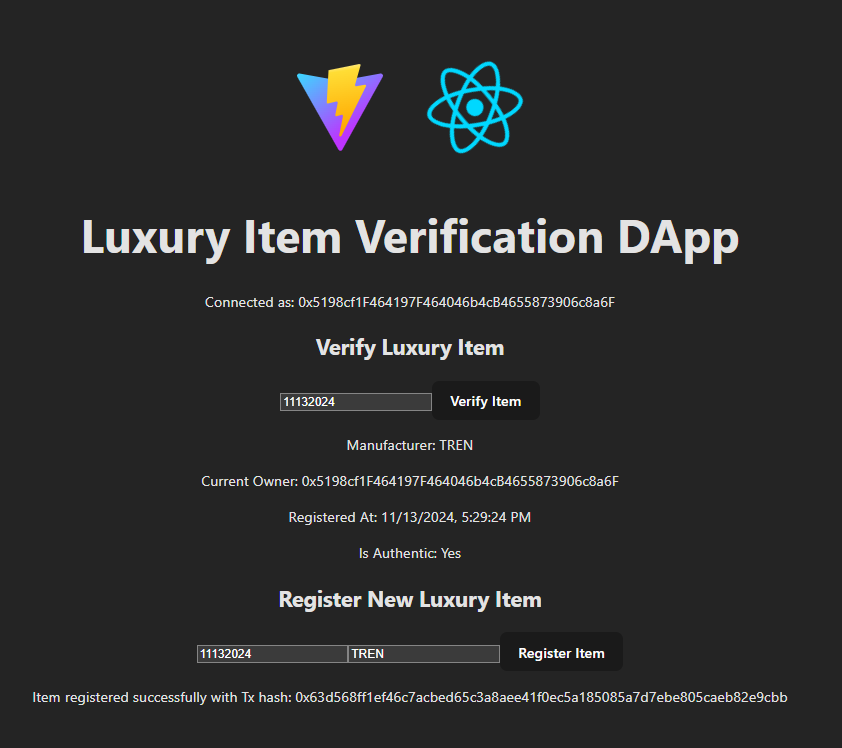

# Luxury Item Authenticity DApp

## Description

This DApp enables the verification of luxury item authenticity (such as watches and jewelry) using a "digital passport" stored on the blockchain through a smart contract. The application is designed to prevent counterfeiting, allowing users to verify item authenticity and authorized users to register new items.

## Access the DApp

The DApp is deployed and available on Google Pages.



## Project Structure

The project consists of three main layers:

1. **Smart Contract (Logic Layer)**: A Solidity smart contract that allows for the registration and verification of luxury items. It has been deployed on the Ganache test network.
2. **Visual Interface (Client Layer)**: A simple user interface developed with React and TypeScript. It provides forms for verifying and registering items via MetaMask.
3. **Web3 Provider (Connection Layer)**: `ethers.js` and MetaMask are used to connect the interface with the smart contract, allowing both read and write actions on the blockchain.

---

## DApp Features

1. **Authenticity Verification**: Users can enter an item's serial number and verify its authenticity. The DApp displays details such as the manufacturer, current owner, registration date, and authenticity status.

2. **Item Registration**: Authorized users can register new luxury items by providing a serial number and manufacturer name. This registration is securely stored on the blockchain.

---

## Questions Answered

### What is the purpose of the DApp?

The DApp's purpose is to provide a solution for verifying the authenticity of luxury items using blockchain technology, helping to prevent counterfeiting and ensuring transparency in the luxury goods market.

### What variables and functions are in the Smart Contract?

The `LuxuryItemAuth` smart contract includes the following key variables and functions:

- **Variables**:

  - `owner`: Address of the contract owner.
  - `items`: Mapping that stores data for each registered item, including the manufacturer, current owner, registration date, and authenticity status.

- **Functions**:
  - `registerItem(string serialNumber, string manufacturer)`: Allows the contract owner to register a luxury item.
  - `verifyItem(string serialNumber)`: Allows users to verify an item's authenticity.

### What library did you implement for the connection layer: Web3.js or Ethers.js? Why?

`ethers.js` was used for the Web3 connection layer. `ethers.js` is compatible with TypeScript and easily integrates with MetaMask for both read calls and write transactions to the contract. Additionally, it provides a simple, secure interface for working with smart contracts on the Ethereum blockchain.

---

## Installation and Configuration

1. **Clone the repository**:

   ```bash
   git clone https://github.com/brianmontero18/dapp-luxury-auth-verification
   cd dapp-luxury-auth-verification
   ```

2. **Configure environment variables** (in `.env`):

   - `ETH_GANACHE_TESTNET_RPC`: Ganache network.
   - `SIGNER_GANACHE_PRIVATE_KEY`: private key to sign your operations.

3. **Install dependencies**:

   Install dependencies in the frontend directory:

   ```bash
   cd frontend
   npm install
   ```

   Install dependencies in the root directory for smart contracts:

   ```bash
   cd ..
   npm install
   ```

   This will start the React application, which will be accessible at http://localhost:5173.

4. **Deploy the smart contract locally**:

   ```bash
   npm run deploy --network ethereum_ganache_testnet

   ```

5. **Save the deployed contract address**:

   CAfter deploying the contract, copy its address and paste it into the file [frontend/src/constants.ts](frontend/src/constants.ts)

---

## Smart Contract Deployment

The `LuxuryItemAuth` smart contract was deployed on the Ganache test network using `Hardhat`. Deployment instructions can be found in the `scripts/deploy.ts` file within the project.

---

## How to Use the DApp

1. Connect your wallet to MetaMask and select the Ganache network.
2. Enter an item's serial number to verify its authenticity or register it via the form provided on the visual interface.

---

## Documentation & Links

### Deployed Contract Addresses & Verification Links

The contract was deployed on the Sepolia testnet and has been verified on Etherscan:

- **LuxuryItemAuth Contract** - [0xa6A0F4B2E7feFCe948bdc994FD4D19AD84971567](https://sepolia.etherscan.io/address/0xa6A0F4B2E7feFCe948bdc994FD4D19AD84971567#code)

### Transaction Hashes for Key Operations

Key operations performed after deployment, including minting a sample luxury item and registering a new item, are as follows:

- **Minted Sample Item (Rolex with serial number 123456789)**: [0x501481330c578ce2e15da667d8c1d27a7477299ba3139570362f5815816a353b](https://sepolia.etherscan.io/tx/0x501481330c578ce2e15da667d8c1d27a7477299ba3139570362f5815816a353b)

- **Registered New Item (TREN with serial number 11132024)**: [0x63d568ff1ef46c7acbed65c3a8aee41f0ec5a185085a7d7ebe805caeb82e9cbb](https://sepolia.etherscan.io/tx/0x63d568ff1ef46c7acbed65c3a8aee41f0ec5a185085a7d7ebe805caeb82e9cbb)

## Proposed enhancements for the DApp

### 1 - What visual improvements would I introduce to the DApp?

To enhance the user experience and usability, the following visual improvements are proposed:

- **Detailed item verification panel**: add image galleries for luxury items, showcasing photos from multiple angles and detailed features such as serial numbers or engravings. These images can be retrieved from IPFS.
  Include downloadable certificates of authenticity, providing users with verified documents associated with each item.

- **Ownership history timeline**: introduce an interactive timeline view that tracks the ownership history of the item, including previous owners and transaction details. This feature will provide traceability and transparency for users, especially in the resale market.

- **Item management interface**: allow item owners to update metadata, such as adding new photos or maintenance records, controlled by role-based permissions in the smart contract.

- **Search and explore capabilities**: implement advanced search and filtering options for registered items, enabling users to search by material, manufacturer, or year of creation. This will improve usability as the number of items grows.

- **Integration with IPFS**: design the UI to dynamically load images and documents stored on IPFS. This ensures users can access all rich metadata seamlessly without performance bottlenecks.

- **Enhanced notifications and feedback**: use Snackbar or Toast notifications to provide users with real-time updates for actions like registration, verification, or failures.

- **Improved wallet integration**: add a wallet status section in the header, displaying the connected wallet address and network. This reassures users and improves transparency during interactions.

### 2 - Does the DApp require a decentralized storage system like IPFS?

While the current version of the DApp stores metadata such as serial numbers and manufacturer details directly on-chain, IPFS will become essential in future iterations for the following reasons:

- **Storing rich metadata**: future versions will require storing high-resolution images, detailed descriptions, and certificates of authenticity for luxury items. IPFS is an optimal solution for handling these larger files.

- **Enabling dynamic and scalable data**: metadata requirements will grow over time, including maintenance logs, resale records, and additional certifications. IPFS provides a scalable storage solution, allowing us to store only the CID (Content Identifier) on-chain, significantly reducing gas costs.

- **Decentralization and data integrity**: IPFS ensures that metadata remains decentralized and tamper-proof. The cryptographic hash associated with each CID guarantees data integrity, aligning perfectly with the DApp’s goal of providing transparent and reliable authentication.

- **Facilitating tokenization and interoperability**: as luxury items are tokenized into NFTs, IPFS becomes the standard for attaching metadata such as images and descriptions to these tokens. This integration also ensures compatibility with NFT marketplaces like OpenSea or Rarible.

- **Supporting future features**:

  - **Dynamic updates**: Owners could update images or add documents like repair logs or appraisals.
  - **File previews**: Users can preview images or certificates directly within the DApp interface.
  - **Seamless downloads**: Authenticated users can download high-resolution files or certificates.

- **Cost-effective and user-friendly**: storing large files directly on-chain is costly and inefficient. IPFS ensures that luxury item metadata remains decentralized and easily accessible while maintaining low on-chain storage costs.

### 3 - Does the DApp require a mechanism to manage gas for users?

Currently, the DApp requires users to pay gas fees for registering and verifying luxury items. While this is acceptable for a proof-of-concept or limited use, it poses significant barriers for scalability and adoption among non-crypto-native users. As the DApp grows, implementing **gas management mechanisms** will be crucial for the following reasons:

1. **Improving accessibility**: many users of luxury item verification systems may not be familiar with crypto wallets or gas fees. Requiring Ether for every interaction creates friction, especially for non-technical or first-time users.

2. **Cost predictability**: gas fees on Ethereum can vary significantly depending on network congestion. This variability can discourage users from interacting with the DApp, particularly during peak times.

3. **Streamlining user experience**: abstracting gas fees allows the DApp to provide a seamless experience, similar to traditional web applications. Users can focus on verifying or registering their luxury items without worrying about blockchain-specific details.

### Proposed solution:

- **Meta-transactions**: use solutions like **OpenGSN** (Gas Station Network) to enable users to interact with the DApp without needing to hold Ether. A relayer pays the gas fees on behalf of the user, and the DApp could recover these costs through a small service fee or premium feature model.

### Trade-offs:

- Meta-transactions add complexity to the backend and smart contracts, requiring the implementation of relayer infrastructure.
- Gas costs for relayed transactions would need to be subsidized or covered by the DApp’s revenue model, which could add financial overhead.

### 4 - Is a scalability solution like Polygon necessary for this use case?

The current implementation of the DApp is deployed on Ethereum, which provides robust security and decentralization. However, as the number of registered luxury items and interactions grows, **scalability concerns will arise**, particularly due to Ethereum’s high gas fees and limited transaction throughput.

### Why scalability is necessary:

1. **High transaction costs**: registering or verifying luxury items can become prohibitively expensive during periods of high network activity, limiting the DApp’s accessibility for smaller transactions or less affluent markets.

2. **Future scalability needs**: as the DApp integrates richer metadata (e.g., images, certificates), the frequency of interactions with the blockchain will increase. Without scalability solutions, the DApp may struggle to handle a high volume of transactions efficiently.

3. **Expanding user base**: targeting a global audience, particularly in markets where transaction costs are a significant barrier, requires a more cost-effective blockchain solution.

### Proposed solution:

- **Polygon zkEVM**: which provides scalability through zero-knowledge rollups while inheriting Ethereum’s security. This is particularly suitable for high-value luxury items where security is paramount. Polygon is EVM-compatible, making it straightforward to migrate the existing smart contracts and frontend without significant architectural changes.

### Trade-offs:

- Polygon solutions, while cheaper and faster, rely on Ethereum’s security through periodic checkpoints. This introduces a slight delay for finality compared to mainnet Ethereum.
- Users may need to bridge assets between Ethereum and Polygon, adding a minor complexity.
